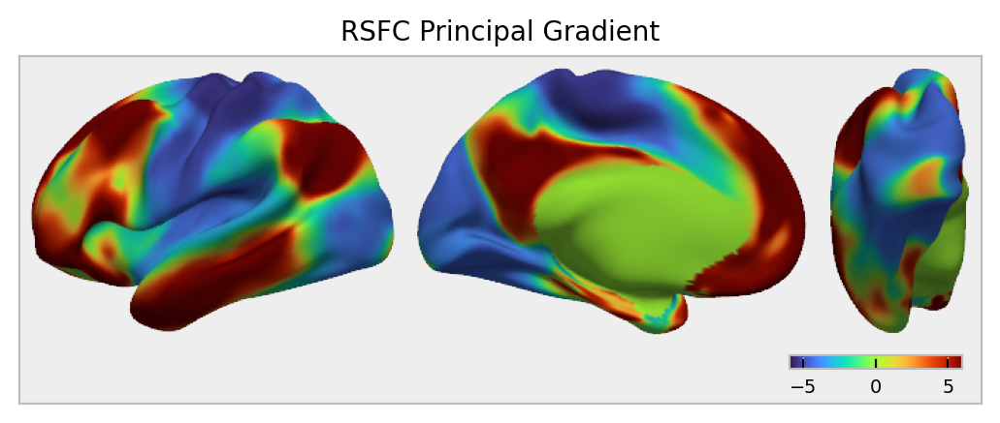
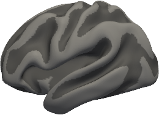

# yaspy

Yaspy (yet another surface plotting python library) is a tool for making neuroimaging surface plots, from simple screenshots to multi-panel montages to publication ready figures. It is built on top of [PyVista](https://docs.pyvista.org/), [Matplotlib](https://matplotlib.org/), and [Pillow](https://pillow.readthedocs.io/en/stable/index.html).

<p align="center">
  
</p>

## Installation

Install from github with pip via

```bash
pip install git+https://github.com/childmindresearch/yaspy.git
```

To run the example notebooks, you'll also need to install [nilearn](https://nilearn.github.io) and [neuromaps](https://github.com/netneurolab/neuromaps). You can install everything in one command with

```bash
pip install 'git+https://github.com/childmindresearch/yaspy.git#egg=yaspy[examples]'
```

## Example

```python
from neuromaps.datasets import fetch_fslr

import yaspy

surfaces = fetch_fslr()
surf_path, _ = surfaces["inflated"]
sulc_path, _ = surfaces["sulc"]

plotter = yaspy.Plotter(surf_path, hemi="lh", sulc=sulc_path)
plotter.screenshot(view="lateral")
```

<p align="left">
  
</p>

## Tutorial

See our [tutorial notebook](examples/tutorial.ipynb) for an in-depth tour of what you can do with yaspy.

## Related libraries

- [nilearn](https://nilearn.github.io/dev/modules/generated/nilearn.plotting.plot_surf.html)
- [brainspace](https://brainspace.readthedocs.io/en/latest/python_doc/api_doc/brainspace.plotting.html)
- [pycortex](https://github.com/gallantlab/pycortex)
- [surfplot](https://github.com/danjgale/surfplot)
- [brainplotlib](https://github.com/feilong/brainplotlib)
